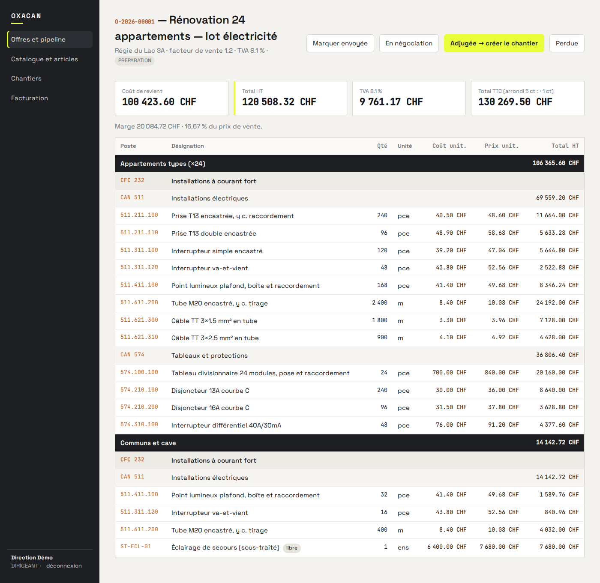
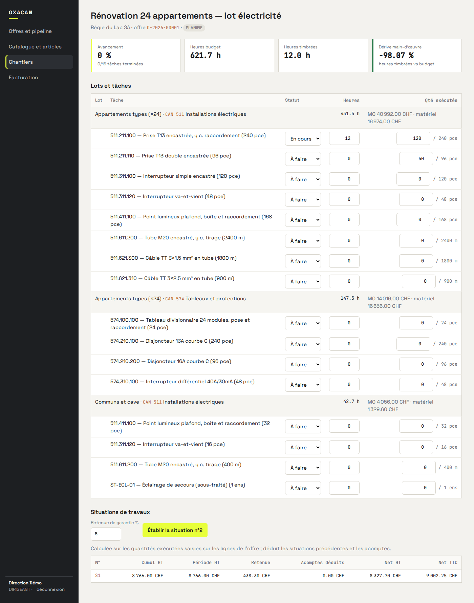
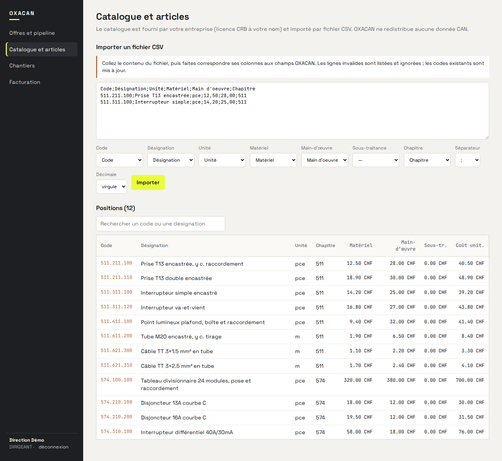
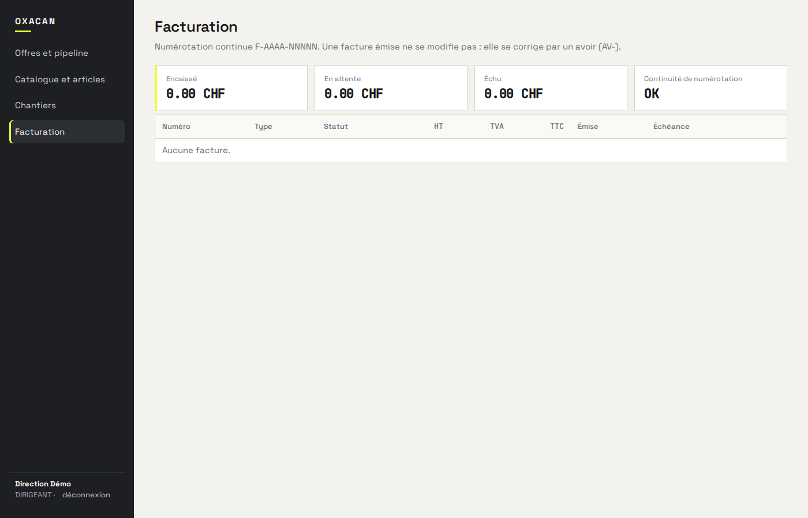

# OXACAN

Plateforme SaaS pour les professionnels du bâtiment en Suisse : de l'offre à l'encaissement, sans ressaisie.

Ce dépôt contient le socle technique d'OXACAN : le **moteur de chiffrage** (calculs déterministes, testés), l'**API** multi-entreprises (NestJS, PostgreSQL) et l'**interface web** (React). Il couvre aujourd'hui le pilier *Chiffrage / Offres* et la colonne vertébrale de la continuité numérique : catalogue → offre → adjudication → chantier → situation de travaux → facture.

## État du dépôt

| Domaine | État | Où |
|---|---|---|
| Moteur de chiffrage (offre, TVA, arrondis, situations, numérotation, import CSV, offre→lots) | Fonctionnel, 25 tests | `packages/engine` |
| API multi-entreprises, authentification JWT, 4 rôles | Fonctionnel, 13 tests bout-en-bout sur PostgreSQL | `apps/api` |
| Isolation des données par entreprise (colonne `tenantId` + politiques RLS PostgreSQL) | Fonctionnel | `apps/api/prisma/migrations` |
| Catalogue par import CSV avec écran de correspondance des colonnes | Fonctionnel | API + web |
| Articles composés (Q25) | Fonctionnel (API) | API |
| Offre Zone › CFC › Chapitre › Article, totaux, pipeline commercial | Fonctionnel | API + web |
| Adjudication → chantier, lots, tâches, budgets d'heures (Q34) | Fonctionnel | API + web |
| Tableau de bord chantier (avancement, heures, dérive MO) | Fonctionnel | API + web |
| Situations de travaux (quantités exécutées, retenue, acomptes) | Fonctionnel | API + web |
| Factures (numérotation continue, avoirs, portefeuille) | Fonctionnel | API + web |
| Éditeur d'offre dans l'interface (création/édition de lignes) | À faire — création par API aujourd'hui | — |
| PDF d'offre et de facture, facture QR | À faire | — |
| Application mobile terrain (timbrage), CRM, RH, stock, IA, PV | À faire | voir `docs/ROADMAP.md` |

La liste exhaustive et datée est dans `CHANGELOG.md`. Ce qui n'est pas dans le tableau ci-dessus n'existe pas encore dans le code.

## Démarrer en local

Prérequis : Node 20+, PostgreSQL 16 (ou Docker).

```bash
docker compose up -d db                    # PostgreSQL 16 sur :5432 (ou utilisez une instance existante)
cp .env.example .env                       # puis ajustez DATABASE_URL / JWT_SECRET
npm install
npm run build -w packages/engine
npm run db:migrate                         # applique les migrations Prisma (schéma + RLS)
npm run db:seed                            # entreprise de démonstration, catalogue fictif, une offre
npm run dev:api                            # API sur http://localhost:3000/api
npm run dev:web                            # interface sur http://localhost:5173
```

Comptes de démonstration : `dir@demo.oxacan.ch` (Dirigeant), `chef@demo.oxacan.ch` (Chef de projet), `tech@demo.oxacan.ch` (Technicien) — mot de passe `demo12345`.

## Tests

```bash
npm test          # moteur (vitest) + API bout-en-bout (vitest + supertest sur oxacan_test)
npm run lint      # vérification des types sur les trois paquets
```

Les tests de l'API réinitialisent la base `DATABASE_URL_TEST` avant chaque exécution. Chaque règle métier testée cite la question client qu'elle implémente (Q20, Q21, Q23, Q25, Q28–Q30, Q34, Q36 des *Réponses aux questions* du 25 août 2026).

## Structure

```
packages/engine   moteur de calcul pur (aucune I/O, aucune dépendance runtime)
apps/api          NestJS + Prisma — modules auth, catalogue, offers, projects, invoices, health
apps/web          React + Vite — pages Offres, Catalogue, Chantiers, Facturation
docs/             ARCHITECTURE.md, API.md, DATA-MODEL.md, ROADMAP.md, adr/ (décisions)
```

## Documentation

- `docs/ARCHITECTURE.md` — vue d'ensemble, choix techniques, sécurité, hébergement
- `docs/API.md` — endpoints et exemples d'appels
- `docs/DATA-MODEL.md` — modèle de données et règles d'intégrité
- `docs/adr/` — décisions d'architecture, une par fichier, datées
- `docs/ROADMAP.md` — ce qui reste à construire, par module

## Licence

Propriété d'OXACAN. Code livré dans le cadre du contrat de développement. Aucune donnée CAN/CRB n'est incluse : les codes de structure (511, 574) et les prix du jeu de démonstration sont fictifs.

## Captures (état du 25 septembre 2026)

| | |
|---|---|
|  |  |
| Détail d'offre : arborescence, totaux, marge | Chantier : lots, tâches, timbrage, quantités exécutées, situation S1 |
|  |  |
| Import CSV avec correspondance de colonnes | Facturation et portefeuille |
